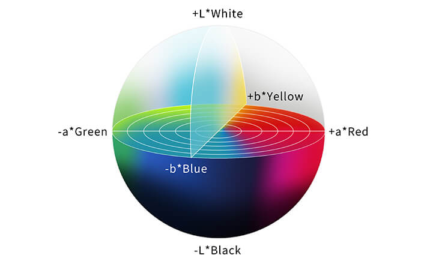

# Awesome Colorization
Some overall knowledge in Colorization.

## 1. Lab color space

References:
- [x] Printing Materials LAB. [Color Theory: 7. Color Space](https://www.youtube.com/watch?v=5Bn8_gyf5VQ).

## 2. Gamut concept
- **Gamut** is the **range** of color values in a specific **color space** or a particular **device**.

- In the **RGB** color space, the **domain** of R, G, B is [0; 1; ...; 255]. So Gamut includes 255^3 values.

- In the **Lab** color space, the **domain** of L, a, b is:
  - L ∈ DL, DL = [0; 100]
  - a ∈ Da, Da = [-128; 127]
  - b ∈ Db, Db = [-128; 127]
  - In theory, because L, a, b are continuous values, Gamut now includes an infinite number of values, expressed in the form (L, a, b), such that L ∈ DL, a ∈ Da, b ∈ Db. However, in reality, there is no device that can represent infinitely many values. So Gamut will not be infinite, but limited by the bit depth used to encode the values.
